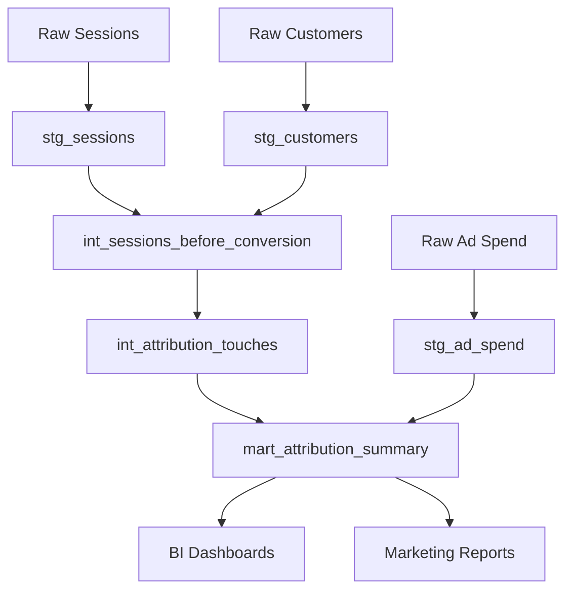

# Marketing Attribution dbt Project

A comprehensive marketing attribution model built with dbt Cloud and Snowflake that helps you understand which marketing channels and campaigns are driving conversions and revenue.

## 📊 What This Project Does

This project implements **positional attribution modeling** to answer key marketing questions:
- Which channels are driving the most conversions?
- What's the ROI of each marketing campaign?
- How do different attribution models compare?
- Which customer journeys are most effective?

**Key Features:**
- ✅ Multiple attribution models (first-touch, last-touch, linear, 40-20-40)
- ✅ Revenue and ROI analysis with ad spend integration
- ✅ Customer journey analysis with multi-touch attribution
- ✅ Flexible attribution window (default: 30 days)
- ✅ Production-ready with testing and documentation

---

## 🚀 Quick Start

### Prerequisites
- Snowflake account with database creation permissions
- dbt Cloud account
- GitHub repository access

### 1. Set Up Your Environment
```sql
-- Run in Snowflake to create database structure
CREATE DATABASE MARKETING_ATTRIBUTION;
CREATE SCHEMA RAW_DATA;
CREATE SCHEMA STAGING; 
CREATE SCHEMA INTERMEDIATE;
CREATE SCHEMA MARTS;
```

### 2. Load Sample Data
Execute the sample data scripts from the setup guide to create realistic test data with 10 customers and their marketing journeys.

### 3. Configure dbt Project
Connect your dbt Cloud project to this repository and configure your Snowflake connection with:
- Database: `MARKETING_ATTRIBUTION`
- Schema: `STAGING` (default target schema)

### 4. Run the Models
```bash
dbt deps
dbt run
dbt test
```

### 5. View Results
```sql
-- See your attribution summary
SELECT * FROM MARKETING_ATTRIBUTION.MARTS.MART_ATTRIBUTION_SUMMARY;
```

---

## 📁 Project Structure

```
models/
├── staging/              # Clean and standardize raw data
│   ├── _sources.yml      # Source table definitions
│   ├── stg_customers.sql # Customer conversion data
│   ├── stg_sessions.sql  # Website session data  
│   └── stg_ad_spend.sql  # Advertising spend data
│
├── intermediate/         # Business logic and transformations
│   ├── int_sessions_before_conversion.sql  # Sessions within attribution window
│   └── int_attribution_touches.sql        # Attribution points calculation
│
├── marts/               # Final business-ready tables
│   └── mart_attribution_summary.sql      # Aggregated attribution metrics
│
└── schema.yml           # Model documentation and tests
```

---

## 🎯 How to Use

### View Attribution Results

**Basic channel performance:**
```sql
SELECT 
    utm_source,
    SUM(linear_conversions) as conversions,
    SUM(linear_revenue) as revenue,
    AVG(cost_per_acquisition_linear) as avg_cpa
FROM MARKETING_ATTRIBUTION.MARTS.MART_ATTRIBUTION_SUMMARY
WHERE total_spend > 0
GROUP BY utm_source
ORDER BY revenue DESC;
```

**Compare attribution models:**
```sql
SELECT 
    utm_source,
    SUM(linear_conversions) as linear_conversions,
    SUM(forty_twenty_forty_conversions) as forty_twenty_forty_conversions,
    SUM(linear_revenue) as linear_revenue,
    SUM(forty_twenty_forty_revenue) as forty_twenty_forty_revenue
FROM MARKETING_ATTRIBUTION.MARTS.MART_ATTRIBUTION_SUMMARY
GROUP BY utm_source;
```

**Monthly trend analysis:**
```sql
SELECT 
    date_month,
    utm_source,
    linear_conversions,
    linear_revenue,
    return_on_ad_spend_linear
FROM MARKETING_ATTRIBUTION.MARTS.MART_ATTRIBUTION_SUMMARY
WHERE date_month >= '2024-01-01'
ORDER BY date_month, linear_revenue DESC;
```

### Key Models Explained

| Model | Purpose | Output |
|-------|---------|--------|
| `stg_customers` | Clean customer conversion data | Customer ID, conversion date, revenue |
| `stg_sessions` | Clean website session data | Session details with UTM parameters |
| `int_sessions_before_conversion` | Filter sessions to attribution window | Sessions that occurred before conversion |
| `int_attribution_touches` | Calculate attribution points | Attribution weights and revenue allocation |
| `mart_attribution_summary` | Final aggregated metrics | Channel performance, ROI, and trends |

### Dashboard Creation

**Recommended visualizations:**
1. **Channel Performance Bar Chart** - Revenue by utm_source using linear attribution
2. **Attribution Model Comparison** - Side-by-side comparison of different models
3. **ROI Scatter Plot** - Cost per acquisition vs. return on ad spend
4. **Monthly Trend Lines** - Conversion trends over time by channel
5. **Customer Journey Analysis** - Average touchpoints before conversion

---

## ⚙️ Configuration Options

### Change Attribution Window
Edit `int_sessions_before_conversion.sql`:
```sql
-- Change from 30 days to 60 days
and s.started_at >= dateadd(days, -60, c.converted_at)
```

### Custom Attribution Model
Add to `int_attribution_touches.sql`:
```sql
-- Example: 60% first touch, 40% last touch
case
    when session_index = 1 then 0.6
    when session_index = total_sessions then 0.4
    else 0.0
end as custom_points
```

### Production Scheduling
Set up dbt Cloud job:
- **Daily refresh**: `dbt run` at 6 AM
- **Testing**: `dbt test` after each run
- **Alerts**: Email on failure

---

## 📈 Sample Insights

With the included sample data, you'll see insights like:

- **Google drives 35% of revenue** but has the highest cost per acquisition
- **Facebook retargeting campaigns** show 3.2x return on ad spend
- **Direct traffic** accounts for 40% of last-touch attribution but only 15% of first-touch
- **Multi-touch journeys** (3+ interactions) generate 60% higher average order values

---

## 🔧 Troubleshooting

### Common Issues

**Models not materializing to correct schemas:**
- Ensure `dbt_project.yml` has custom schema configuration
- Check your dbt Cloud connection target schema

**Attribution points don't sum to 1.0:**
- Verify session filtering logic in `int_sessions_before_conversion.sql`
- Check for duplicate sessions in source data

**Missing revenue data:**
- Confirm customer conversion dates align with session timestamps
- Validate join logic between sessions and customers

**Performance issues:**
- Consider materializing intermediate models as tables
- Add incremental configuration for large datasets
- Use appropriate indexes in Snowflake

### Getting Help

1. Check dbt logs: `dbt --debug run`
2. Validate source data: `dbt test --select source:*`
3. Review model lineage: `dbt docs generate && dbt docs serve`

---

## 🚀 Next Steps

Ready to enhance your attribution model? Check out the **Enhancement Guide** for:

- **Multi-channel expansion**: Email, social media, and offline touchpoints
- **Advanced attribution**: Markov chains and machine learning models  
- **Customer lifetime value**: CLV-weighted attribution analysis
- **Real-time updates**: Streaming data and incremental processing
- **A/B testing**: Campaign experiment measurement and analysis

---

## 🤝 Contributing

### Adding New Data Sources
1. Create staging model in `models/staging/`
2. Add source definition to `_sources.yml`
3. Update `int_sessions_before_conversion.sql` to include new touchpoints
4. Add tests and documentation

### Modifying Attribution Logic
1. Update `int_attribution_touches.sql` with new calculation
2. Add corresponding revenue calculation
3. Update `mart_attribution_summary.sql` aggregation
4. Test with sample data

### Best Practices
- Always add tests for new models
- Document business logic in model descriptions
- Use consistent naming conventions
- Test with realistic sample data before production

---

## 📄 License

MIT License - See LICENSE file for details

---

## 📚 Resources

- [dbt Documentation](https://docs.getdbt.com/)
- [dbt Marketing Attribution Guide](https://www.getdbt.com/blog/modeling-marketing-attribution)
- [Snowflake Documentation](https://docs.snowflake.com/)
- [Marketing Attribution Best Practices](https://blog.getdbt.com/attribution-playbook/)

---

## 📊 Data Model Overview



**Questions?** Open an issue or contact the analytics team.

---

*Built with ❤️ using dbt Cloud and Snowflake*
